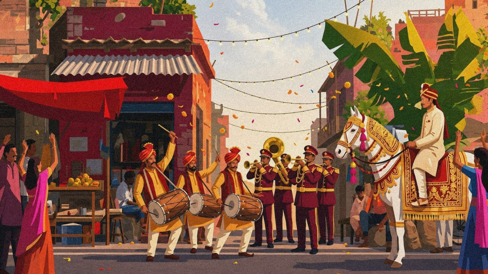

<div align="center">

# 🥁 BARAAT BAND 🎺
### *The Loudest, Most Unapologetic Walk of Your Life*



[](https://react.dev)
[](https://vitejs.dev)
[](https://baraatband.wtf)
[](https://baraatband.wtf)

*Press play, grab a marigold garland, and turn your room into a wedding procession.*

---

</div>

## 🌟 What is Baraat Band?

Ever wanted to experience the sheer, chaotic joy of an **Indian Wedding Baraat** without having to put on an uncomfortably heavy Sherwani or dodge rogue fireworks? 

**Baraat Band** is a full-screen, ultra-aesthetic music player site that streams non-stop Bollywood baraat bangers through a stealth YouTube audio engine while surrounding you with golden-hour wedding visuals, marigold confetti, and high-energy dhol vibes.

---

## 🎮 MINI-GAME: *Which Baraat Persona Are You?* 🕺

Take the 3-second diagnostic test to find your true role in the procession:

```
                  [ START HERE ]
                        │
          Is "Kala Chashma" playing?
           ┌────────────┴────────────┐
          YES                        NO
           │                         │
  Are you wearing sunglasses   Are you holding currency notes
   indoors at 9:30 PM?          above your head?
     ┌─────┴─────┐                   ┌─────┴─────┐
    YES          NO                 YES          NO
     │           │                   │           │
     ▼           ▼                   ▼           ▼
  [ 🕶️ ]       [ 🐴 ]              [ 💸 ]       [ 🥁 ]
THE COOL      THE GROOM           THE CASH    THE DHOL WALI
 DANCER       ON HORSE            THROWER       LEGEND
```

### 🏆 Character Descriptions:
* 🕶️ **The Cool Cousin**: Wearing dark sunglasses inside the venue. Has memorized the full *Kala Chashma* hook step.
* 🐴 **The Groom on the Horse**: Pretending to enjoy riding a horse while internally praying the dhol doesn't scare it.
* 💸 **The Cash Cannon Auntie**: Has a stack of 10-rupee notes ready to wave in circles over everyone's heads.
* 🥁 **The Dhol Legend**: Arms never tire. Heartbeat permanently synced to *Dha-Dhin-Dha*.

---

## ⚡ Interactive Terminal Game: *Beat the Dhol!* 🥁

Try to hit the perfect Dhol rhythm right in your terminal! Run this one-liner in bash:

```bash
# 🥁 Terminal Dhol Rhythm Simulator 🥁
node -e 'let b=0,t=setInterval(()=>{console.log(["🥁 DHAN!","💥 DHIN!","🔥 DHAK!","✨ TAK!"][b%4]);b++;if(b>12){clearInterval(t);console.log("\n🎉 BARAAT ENERGY MAXIMIZED! 🎉\n")}},250)'
```

---

## 📜 The Official Baraat Code of Conduct

1. **The Nagin Dance Mandate**: If *Nagada Sang Dhol* or *Sadi Gali* plays, lying down on the dance floor to perform the Nagin (snake) move is **legally required**.
2. **The Hydration Paradox**: Water is forbidden during the Baraat; energy is strictly derived from pure Dhol vibrations and marigold confetti.
3. **The Horse Safety Radius**: Maintain a 3-foot distance from the Groom’s horse when attempting 360° spins.

---

## 🎵 Tracklist (Pure Dhamaka)

| # | Track Title | Original Artist / Feature | Vibe Level |
|---|-------------|---------------------------|------------|
| 01 | **Kala Chashma** | Badshah & Neha Kakkar | 🕶️ 10/10 |
| 02 | **Nagada Sang Dhol** | Shreya Ghoshal & Osman Mir | 🥁 11/10 |
| 03 | **Aaj Ki Party** | Mika Singh | 🎉 10/10 |
| 04 | **London Thumakda** | Labh Janjua & Sonu Kakkar | 💃 10/10 |
| 05 | **Dholida** | Palak Muchhal & Shail Hada | 💃 10/10 |
| 06 | **Chogada** | Darshan Raval & Asees Kaur | ✨ 9.5/10 |
| 07 | **Gallan Goodiyaan** | Shankar Mahadevan & Others | 🥳 11/10 |
| 08 | **Badri Ki Dulhania** | Dev Negi & Neha Kakkar | 🎺 10/10 |
| 09 | **Banno Tera Swagger** | Brijesh Shandilya | 😎 9.5/10 |
| 10 | **Sadi Gali** | Lehmber Hussainpuri | 🔥 12/10 |

---

## 🎨 Color Palette

```
  ┌──────────┐  ┌──────────┐  ┌──────────┐  ┌──────────┐
  │  #A8232D │  │  #E8A93B │  │  #D6336C │  │  #0D0705 │
  │  Maroon  │  │ Marigold │  │ Hot Pink │  │ NearBlack│
  └──────────┘  └──────────┘  └──────────┘  └──────────┘
```

---

## 🚀 Quickstart

```bash
# 1. Clone & Enter
git clone https://github.com/your-username/baraat-band.git
cd "Baraat Band"

# 2. Install Dependencies
npm install

# 3. Launch the Procession
npm run dev
```

Open [http://localhost:5173](http://localhost:5173) and press **Play**!

---

## ⌨️ Keyboard Shortcuts

* <kbd>Space</kbd> — Play / Pause
* <kbd>→</kbd> — Skip forward 10s
* <kbd>←</kbd> — Skip backward 10s
* <kbd>M</kbd> — Mute / Unmute

---

<div align="center">

Made with 💖, 🥁 Dhol, and 🌸 Marigold Confetti.
*Dilbagh diya har baraat mein!*

</div>
